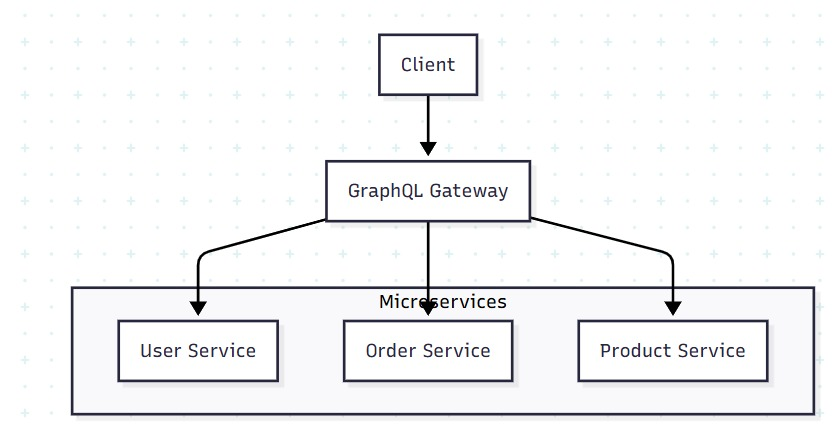
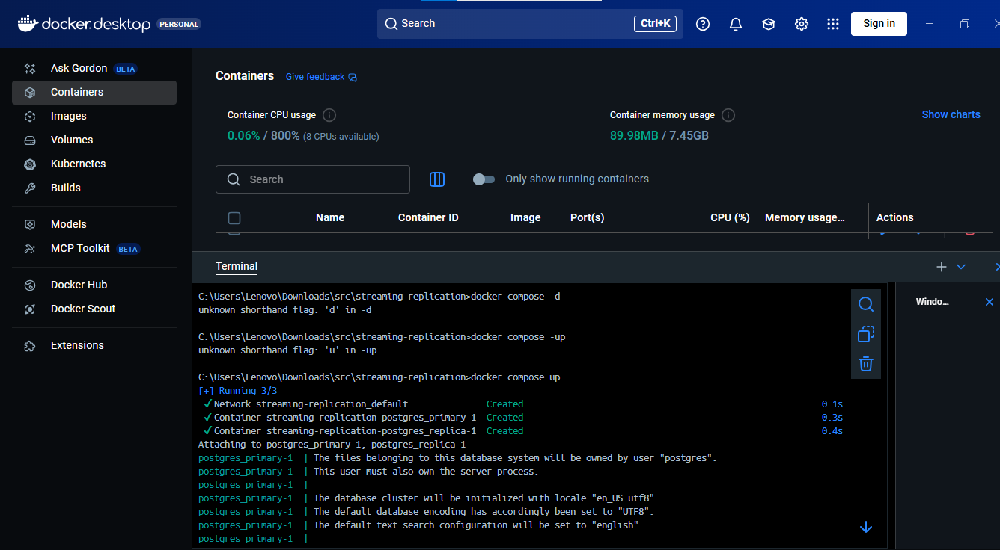
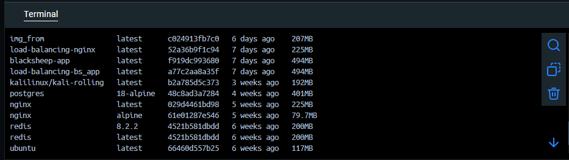

# UTS Sistem Terdistribusi Dan Terdesentralisasi IF-2 Ganjil 2025 Bambang Purnomosidi D.P. - FIF25002T

**Nama    : Christian R**

**Nim     : 235410115**

## Soal
Semua dikerjakan dan di-push ke repo GitHub (atau penyedia repo lainnya; GitLab, dll) milik anda. Nama repo bebas. URL repo anda yang akan anda kirimkan sebagai jawaban UTS. Jawaban ditulis menggunakan markdown. Anda bebas memformat selama tulisan bisa terbaca dengan baik. Jadilah kreatif. 
1. Jelaskan teorema CAP dan BASE dan keterkaitan keduanya. Jelaskan menggunakan contoh yang pernah anda gunakan. 
2. Jelaskan keterkaitan antara GraphQL dengan komunikasi antar proses pada sistem terdistribusi. Buat diagramnya. 
3. Dengan menggunakan Docker / Docker Compose, buatlah streaming replication di PostgreSQL yang bisa menjelaskan sinkronisasi. Tulislah langkah-langkah pengerjaannya dan buat penjelasan secukupnya. 

## Jawaban 

1.  
    CAP Theorem adalah batasan teoritis untuk sistem terdistribusi: Anda hanya bisa memilih dua dari tiga (Consistency, Availability, Partition Tolerance). 
    
    BASE adalah strategi desain yang mengimplementasikan pilihan AP (Availability dan Partition Tolerance) dengan mengakui bahwa konsistensi akan tercapai pada akhirnya, bukan secara instan.

2.   
    2.GraphQL berfungsi sebagai API gateway yang mengkoordinasikan komunikasi antara berbagai layanan mikro (microservices) dalam sistem terdistribusi.

Cara Kerja :
Client mengirim single GraphQL query
Gateway menganalisis query dan menentukan services mana yang dibutuhkan
Gateway mengirim request ke masing-masing service yang relevan
Services mengembalikan data ke gateway
Gateway mengaggregasi data dan mengembalikan response terpadu ke client

3 .

### Langkah langkah pengejaan : 

    * docker-compose.yml: Ini adalah file konfigurasi utama untuk Docker Compose. File ini mendefinisikan layanan (misalnya, server PostgreSQL) yang akan dibuat Docker, jaringan, volume, dan pengaturan lainnya.
    * 00_init.sql: Ini kemungkinan adalah skrip SQL inisialisasi yang akan dijalankan oleh container PostgreSQL saat pertama kali dibuat untuk menyiapkan database, pengguna, atau skema awal.
    * env: Ini adalah file shell script atau file variabel lingkungan yang mungkin berisi kredensial database (username, password), nama database, port, atau konfigurasi spesifik lainnya yang digunakan oleh docker-compose.yml atau container Anda. 

    
    aktifkan docker 

 

jalankan docker compose 

